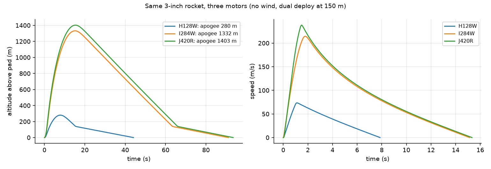
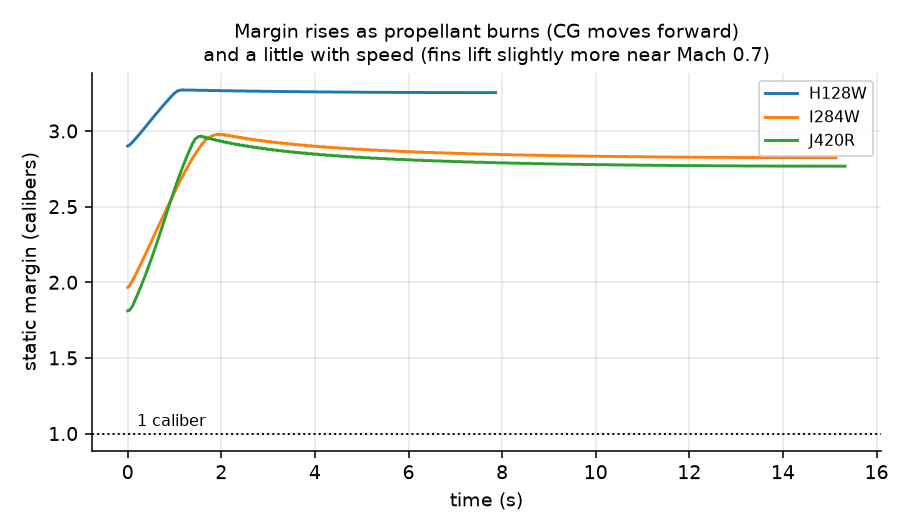
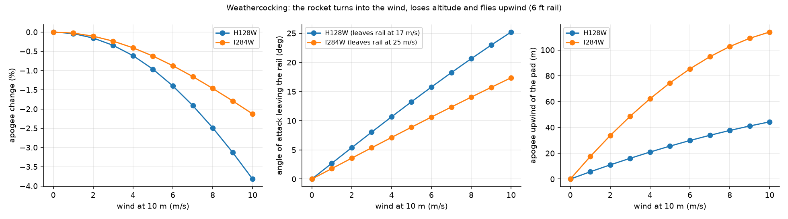
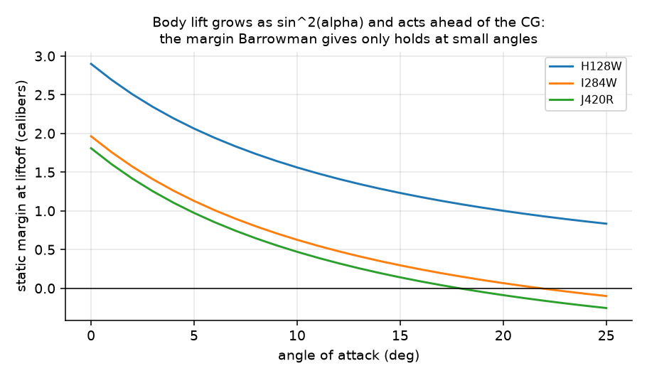
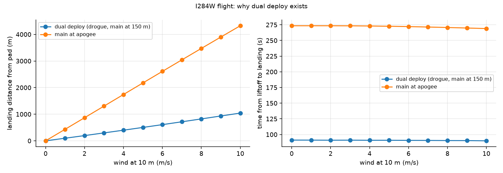
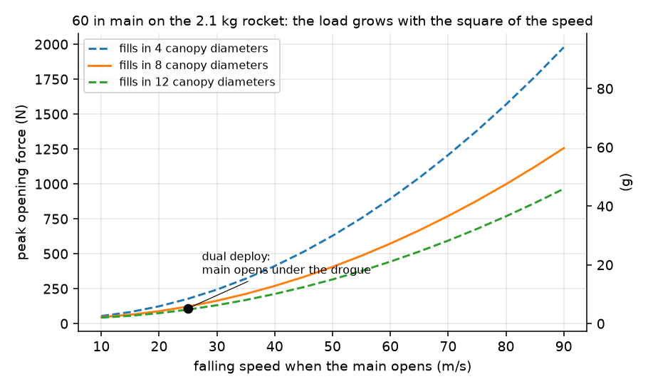
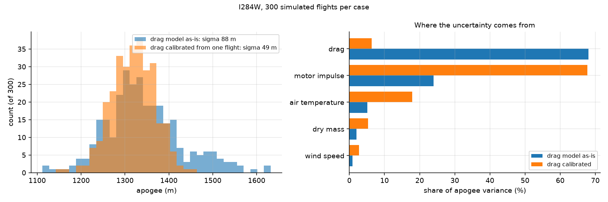
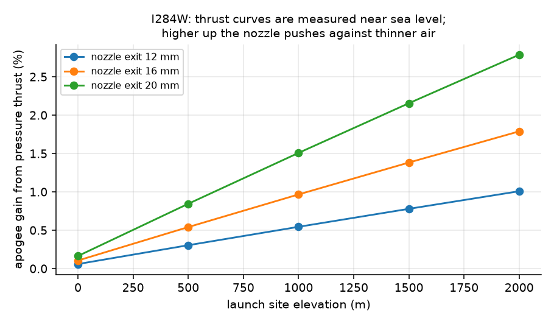
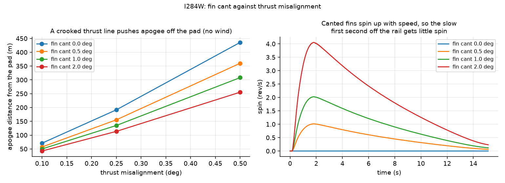
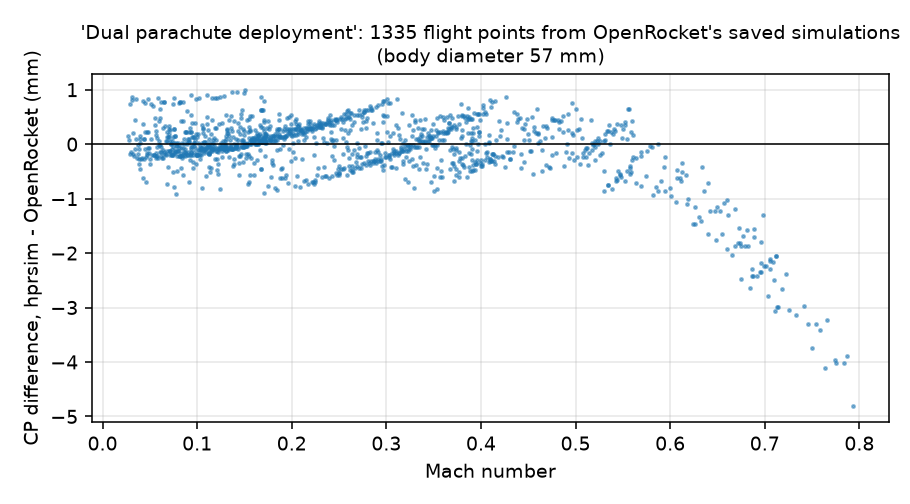

# hpr-flight-sim

[](https://github.com/aneeshkaravadi/hpr-flight-sim/actions/workflows/ci.yml)

A six-degree-of-freedom flight simulator for high-power rockets: certified thrust curves, Barrowman stability, wind, the launch rail, dual-deploy recovery, and a way to calibrate it against a real altimeter.

<!-- TODO(Aneesh): photo of a club launch here, e.g.

-->

## Why I built this

I've designed rockets in OpenRocket, and as the person who led propulsion design for my high school's rocketry club I wanted to understand what actually happens inside the "simulate" button: why a rocket turns into the wind, why the stability margin changes during the flight, and how much to trust a predicted apogee. Writing my own simulator, and checking every piece against physics I could work out by hand, was how I got there.

## What one flight looks like

The example is a typical 3-inch dual-deploy rocket with a 38 mm motor mount, flown on three real AeroTech motors (certified thrust curves from thrustcurve.org).

| Motor | Apogee | Max speed | Off the rail | Static margin, liftoff → burnout |
|---|---|---|---|---|
| H128W | 280 m | 73 m/s | 16.7 m/s | 2.9 → 3.3 cal |
| I284W | 1,332 m | 214 m/s (Mach 0.63) | 25.1 m/s | 2.0 → 2.8 cal |
| J420R | 1,403 m | 238 m/s (Mach 0.70) | 26.9 m/s | 1.8 → 2.8 cal |



The stability margin isn't one number. It climbs while the motor burns, because the propellant mass leaves from the back and the center of gravity moves forward. It also rises a little with speed, because the fins make slightly more lift near Mach 0.7, and settles back as the rocket slows down.



## What it taught me

**Wind matters most right off the rail.** A rocket leaving a 6 ft rail at 16.7 m/s in an 8 m/s wind meets the air at a 20.6° angle of attack, so it turns hard into the wind. On the H128W a longer rail only helps a little: 18.7° from an 8 ft rail, against 23.6° from a 4 ft one. The faster I284W leaves the rail at 25 m/s and only sees 14°. Apogee barely changes (1.5 to 2.5% lower at 8 m/s), but the I284W ends up 103 m upwind of the pad at apogee.



**A 2-caliber margin is a small-angle number.** Barrowman's method treats normal force as linear in the angle of attack and leaves out the body tube's own lift, which grows as sin²α. That's fine in steady flight, but not for a rocket leaving a short rail in wind at 14 to 21°. With Galejs' body-lift correction, the I284W's 2.0-caliber margin at liftoff drops to 0.6 at 10° and almost nothing at 20°, and on the J420R it goes slightly negative. The body lift acts ahead of the CG, so the simulator, which includes it, also shows the rocket turning into the wind less than plain Barrowman predicts: 103 m upwind at apogee instead of 142 m.



**Dual deploy isn't optional on a windy day.** In an 8 m/s wind, opening the main at apogee puts the I284W flight 3.5 km from the pad. Coming down fast under a small drogue and opening the main at 150 m brings that to 825 m.



**The drogue also protects the main.** A parachute doesn't open instantly, and the force while it fills grows with the square of the falling speed. Under the drogue the rocket comes down at 25 m/s, so the 60 in main opens with about 110 N (5 g). Opening it at apogee is gentler (34 N), but then the rocket drifts kilometers. If the drogue failed and the main fired at 60 m/s, the load would be about 570 N, five times higher. That's the load the shock cord and its anchors would have to survive. How quickly a canopy fills is an assumption (I use 8 canopy diameters of travel), so the plot shows 4 and 12 too.



**After you calibrate drag, the motor is the biggest unknown.** I ran 300 flights per case with realistic scatter in drag, dry mass, motor impulse (±3%), wind and air temperature.
- **With my drag model as-is**, the apogee spread is ±88 m (1σ), and 68% of that comes from not knowing the drag well enough.
- **After calibrating drag** from one real flight (`examples/compare_flight.py`), the spread drops to ±48 m, and now 68% of what's left is the motor itself: no two reloads give exactly the same impulse, and no amount of calibration fixes that.



**A high launch site helps mostly through drag, not thrust.** Thrust curves are measured on a test stand near sea level. Higher up, the nozzle pushes against thinner air, so it makes a little more thrust. Moving the I284W flight from sea level to a 2,000 m site raises apogee about 10% just from the thinner air. The extra pressure thrust adds only another 1 to 3%, depending on the nozzle exit size: I swept 12 to 20 mm, because a .eng file doesn't say.



**Spinning the rocket only partly fixes a crooked motor.** If the thrust line is off the body axis by just 0.25°, from a slightly crooked motor mount, the I284W reaches apogee 190 m from the pad with no wind at all. Canting the fins makes the rocket spin, so the crooked push keeps changing direction and partly cancels out. But spin only builds with speed. With 1° of cant it peaks at 2 rev/s near burnout, and the slow first second off the rail, when the rocket is easiest to push around, gets almost none. So 1° of cant cuts the drift to 135 m and 2° to 115 m, not to zero.



<!-- TODO(Aneesh): once you have an altimeter log, add a section here, e.g.
## Checking it against a real flight
Run examples/compare_flight.py with your club rocket's TOML, motor and altimeter CSV (data/flights/), and show the overlay plot,
the uncalibrated error and the fitted drag multiplier. Then predict a second flight on a different motor with that multiplier.
-->

## How I checked it

There are 43 tests, and each compares against something worked out independently:
- standard atmosphere tables
- the published impulse of each motor
- the rocket equation, with no gravity or drag
- exact kinematics for a drag-free vertical flight, and the launch-rail exit speed (to 0.2%)
- Barrowman's nose and fin results, including the quarter-chord CP of a rectangular fin, and the CP of every nose shape from its volume
- the extra speed from pressure thrust at altitude
- the closed-form opening shock of a filling parachute
- the steady roll rate of canted fins and how fast it spins up, and the torque from a misaligned thrust line
- terminal velocity under the main parachute
- masses and positions of an OpenRocket design worked out by hand
- the step size being converged

The one I'm proudest of starts the rocket coasting with a small wobble. It checks that the angle of attack oscillates at the frequency, and decays at the rate, that linearized short-period theory predicts (within 2% and 10%). The derivation is in [DERIVATIONS.md](DERIVATIONS.md).

### Against OpenRocket

OpenRocket saves its simulation results inside each design file, so I imported one of its own bundled examples ("Dual parachute deployment", which ships with OpenRocket and isn't included here) and compared:
- **Dry mass:** 1.3608 kg against OpenRocket's 1.3610.
- **Dry CG:** within 2 mm.
- **CP:** at 1,335 flight points, mine is within 1 mm of OpenRocket's up to Mach 0.6 (0.66 mm RMS overall). OpenRocket stores positions to the millimeter, so that's as close as the data can show. Above Mach 0.6 the two drift apart by up to 5 mm, where both are stretching subsonic theory.

`examples/compare_openrocket.py` runs the same check on any .ork that has saved simulations.



## Using it on your own rocket

1. Describe the rocket in a TOML file. [`rockets/example_3in.toml`](rockets/example_3in.toml) shows every field: nose shape, tube, fins, internal masses, motor. If you already have it in OpenRocket, `rocket.load("my_rocket.ork")` reads the design directly, or `examples/import_ork.py` writes it out as a TOML you can edit. That works for single-stage rockets with one fin set and no diameter changes.
2. Put the motor's `.eng` file from thrustcurve.org in [`data/motors/`](data/motors/). If you measure the nozzle exit with calipers, add `nozzle_exit_diameter` under `[motor]` to include the extra thrust at altitude.
3. Fly it:

```python
from hprsim import rocket, flight
r = rocket.load("rockets/example_3in.toml")
fl = flight.simulate(r, flight.Launch(wind_speed=5, wind_from_deg=200, rail_length=1.83))
print(fl.apogee, fl.events["rail_exit_speed"], fl.events["landing_distance_m"])
```

After a flight, calibrate the drag against the altimeter with `examples/compare_flight.py` ([how](data/flights/README.md)).

<!-- TODO(Aneesh): add your club rocket as rockets/<name>.toml (dimensions and masses from OpenRocket or a scale) and mention it here. -->

## Running it

```bash
pip install -e ".[dev]"
pytest -q                                          # 43 checks, ~15 s
python examples/make_figures.py                    # every figure and number above
python examples/make_figures.py --only weathercock # or just one section
```

`make_figures.py` runs about 650 simulations with a live progress bar. They run at the lowest CPU priority, two at a time by default, and you can press `+`/`-` to change how many run at once, `p` to pause, and `q` to stop.

## Things I got wrong along the way

- **My first Monte Carlo pushed my laptop to 110 °C.** It ran on all ten cores for three and a half minutes. When I profiled it, the drag model was re-integrating the nose cone's surface area about 18,000 times per flight, for a number that never changes. NumPy's general cross product was also slow on 3-element vectors, and the coast phase was using a smaller time step than it needed. Fixing those made each flight 4.3 times faster with the same apogee to the millimeter. That's also why the batch runner has a speed control now.
- **I assumed Barrowman's "parabola" was the same shape as OpenRocket's "parabolic series".** It isn't. Barrowman's is $r \propto \sqrt{x}$, with its CP at half the nose length; the parabolic series has its CP at exactly 7/15 of the length, which my code got right while my test expected the wrong number.
- **The rail-exit speed came out 1% too high,** because I recorded it at the end of the time step instead of interpolating to the exact moment the rocket left the rail.
- **My first example rocket had a static margin of 3 to 4 calibers.** It was very stable, but it would weathercock a lot. Smaller fins brought it to about 2.
- **My fins gained too much lift with speed.** I'd divided the whole fin lift slope by the Prandtl-Glauert factor. When I imported one of OpenRocket's own examples and compared against the CP it had saved, mine sat 8 to 13 mm too far aft above Mach 0.3. Diederich's form, which OpenRocket uses, puts the compressibility inside the aspect-ratio term instead, and now the two agree to within a millimeter. The same comparison caught my nose surface integral overcounting by 0.05%.
- **I originally used the J350W.** Its curve on thrustcurve.org isn't marked public domain, so I switched to the J420R, which is the same case size with a similar impulse.

## What's next

See the [issues](https://github.com/aneeshkaravadi/hpr-flight-sim/issues): transonic drag and real flight comparisons.

---

Aneesh Karavadi, engineering at UNT (TAMS). I used Claude Code to write a lot of the implementation, but the questions, the checks and the conclusions are mine.
